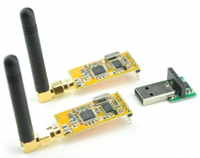
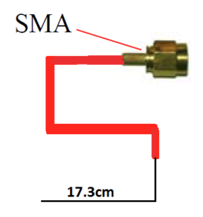

# Comunicaciones por radio.
Las comunicaciones entre el CanSat y la Estación Base la realizamos con los módulos de radiofrecuencia APC220 a 433 MHz. La transmisión se ha ajustado a una velocidad de 2400 baudios y a nivel de potencia 9 para un mayor alcance, para el ajuste de los dispositivos del kit APC220.

Módulos de radiofrecuencia APC220 y adaptador USB

- En el CanSat colocamos un módulo de radiofrecuencia APC220 a 434 Mhz situado en el cuerpo del cansat, con una antena con conector SMA y de longitud 17,3 cm.

Para el cálculo de la longitud de la antena emisora se usa la fórmula, 

1/4 longitud de onda

donde c es la velocidad de la luz y f la frecuencia de transmisión en Hertzios (Hz).

Por tanto

Longitud del cable de antena

Antena CanSat

- En la Estación Base (PC o portátil) tenemos el módulo APC200 con adaptador serie-usb para conectarlo al PC. La antena que lleva el receptor es una de ¼ de onda omnidireccional.

Antena Estación Base

## Documentación:

* Documento: http://esero.es/wp-content/uploads/2019/10/T11_Radio_Communication.pdf
* Construcción antena emisor apc220: https://www.narom.no/undervisningsressurser/the-cansat-book/the-primary-mission/cansat-mechanics-design/antenna-design/
* Configuración APC220: http://beetlecraft.blogspot.com/2015/10/tutorial-apc220.html
* Piezas para carcasa de receptor de radiofrecuencia APC220: https://www.thingiverse.com/thing:643721

Antena Estación Base con caja de protección

