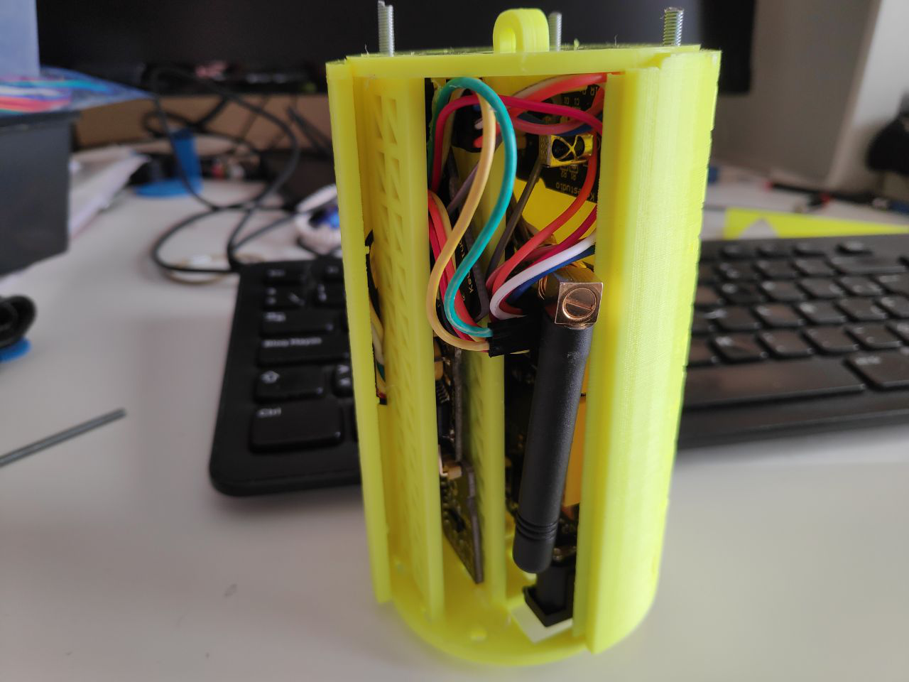

La estructura del CanSat se ha basado en [Canduino](https://leobotmanuel.github.io/cansat-educativo/) donde hemos hecho unas modificaciones para adaptarlo a nuestra solución.

* Pequeña modificación a la tapa superior de canduino para pasar cable antena GPS (https://www.tinkercad.com/things/bsFOAFMVQrr)
* Pequeña modificación de la tapa inferior para dejar ventana para el receptor de infrarrojo (https://www.tinkercad.com/things/5xsrRgHKRlN)
*  Pequeña modificación de la base principal (board 1) para dejar hueco para soldar pines Vin u gnd de alimentación: https://www.tinkercad.com/things/jOn9D70C28O-daring-hillar-hango/edit?sharecode=m-3SnlMZklRwvgwR2qZ_WAvs7LL-Mq2QyISTTGB90wA=

Interior del CanSat

