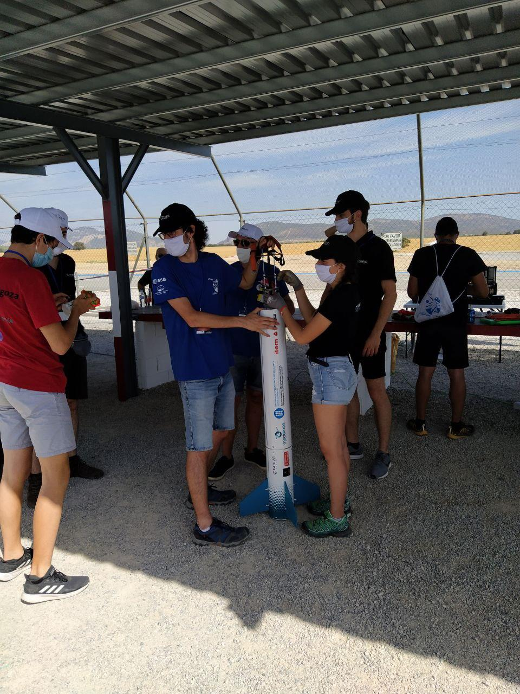
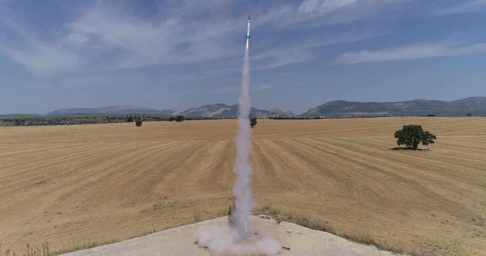
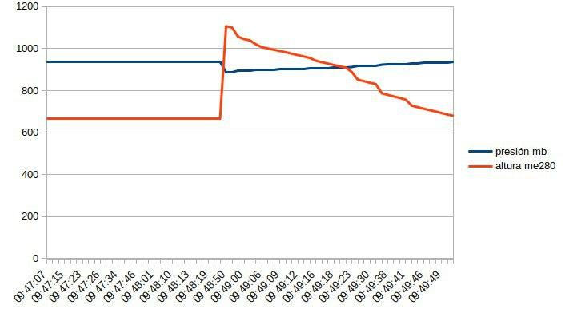

# CanSat-Granada julio 2020
La final de [CanSat-2020](http://esero.es/asi-ha-sido-la-final-nacional-cansat-2020/) se celebró en Granada y el [Club Robótica Granada](https://clubroboticagranada.github.io/) fue invitado a participar.

Nuestra participación, con el trabajo de colaboración con el **Equipo SotoSat**, desarrollamos en muy poco tiempo [**RobocilioSAT**](https://clubroboticagranada.github.io/cansat2020/) consiguiendo buenos resultados y una experiencia única.

[**RobocilioSAT**](https://clubroboticagranada.github.io/cansat2020/) está construido con módulos del kit de desarrollo [M5Stack](https://m5stack.com/) basado en ESP32 y comunicaciones radio LORA.

**Equipo**

**RobocilioSAT**

[Video lanzamiento RobocilioSAT ](../img/galeria/clubConcurso2020/lanzamientoCohete.mp4)

**Seguimiento y procesamiento de datos. Labor realizada por Maribel Ruiz**

[Video resumen Final Nacional CanSat 2020 ](https://www.youtube.com/watch?v=FlV8XL6klDM&feature=emb_logo)

