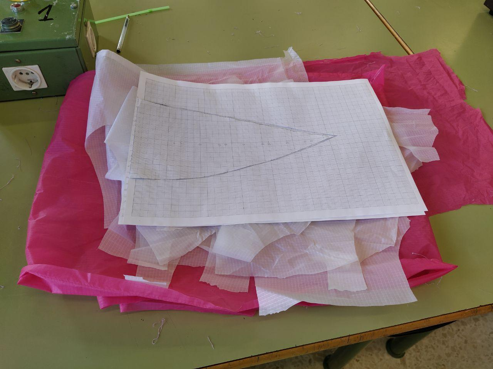
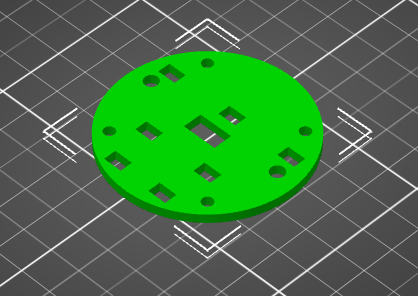
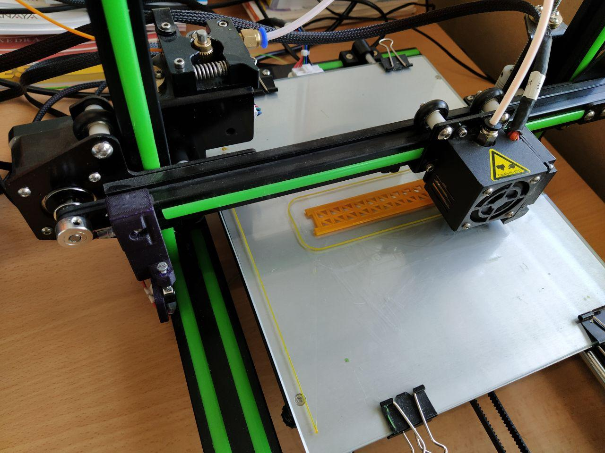
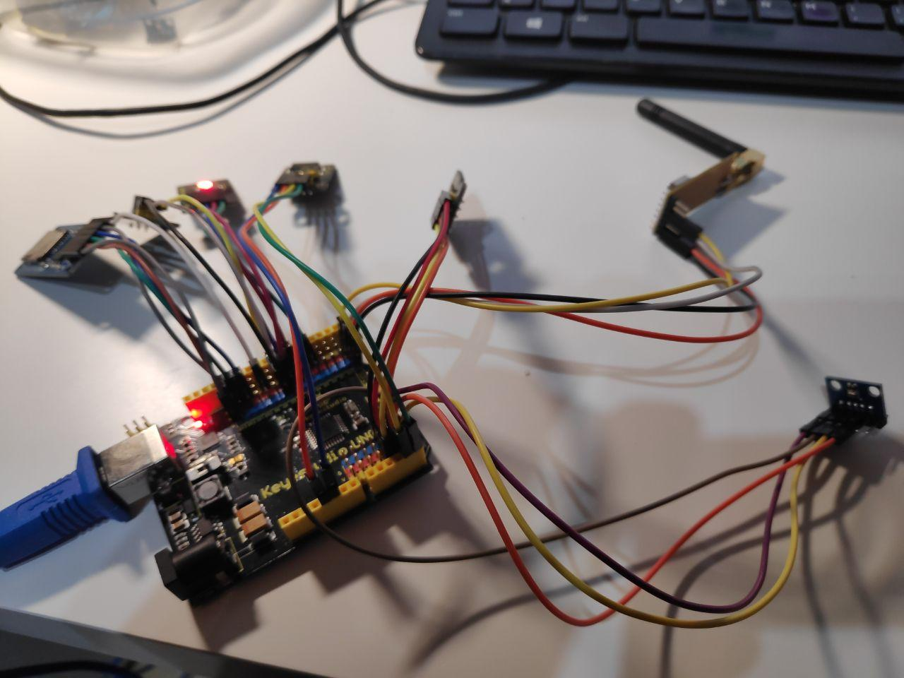
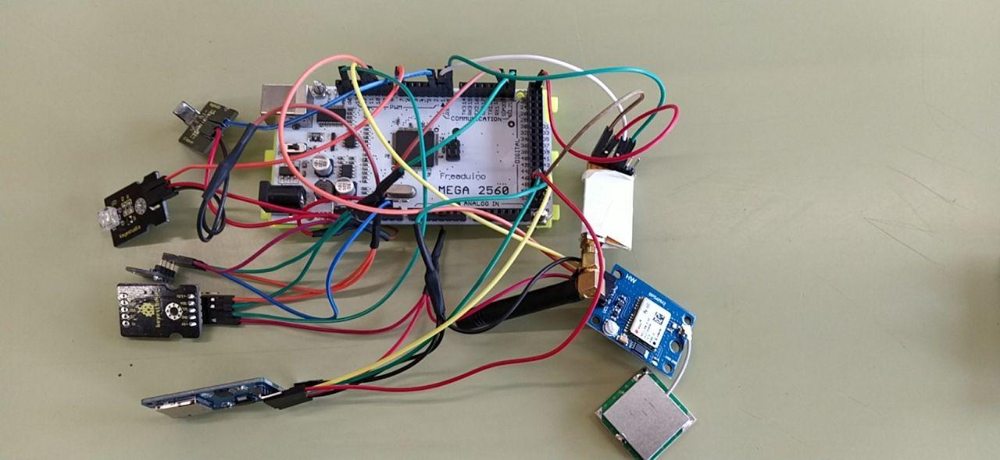
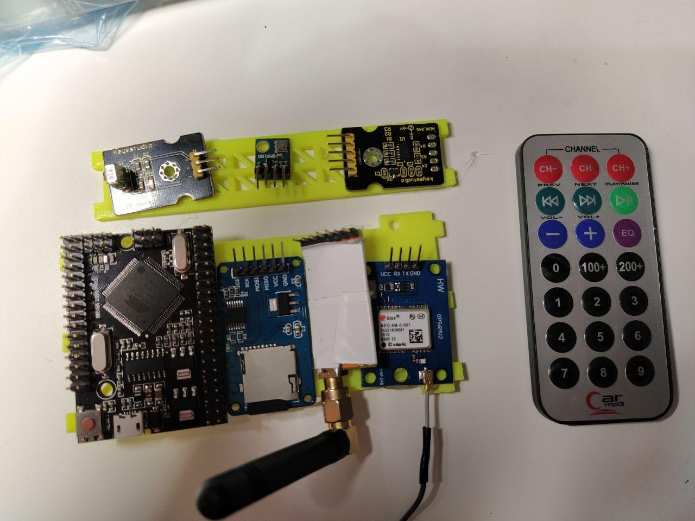
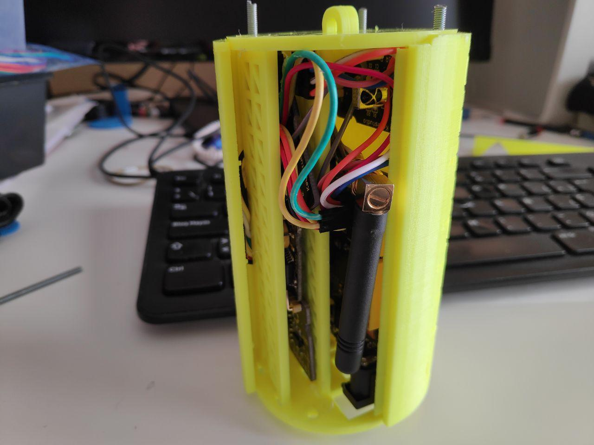
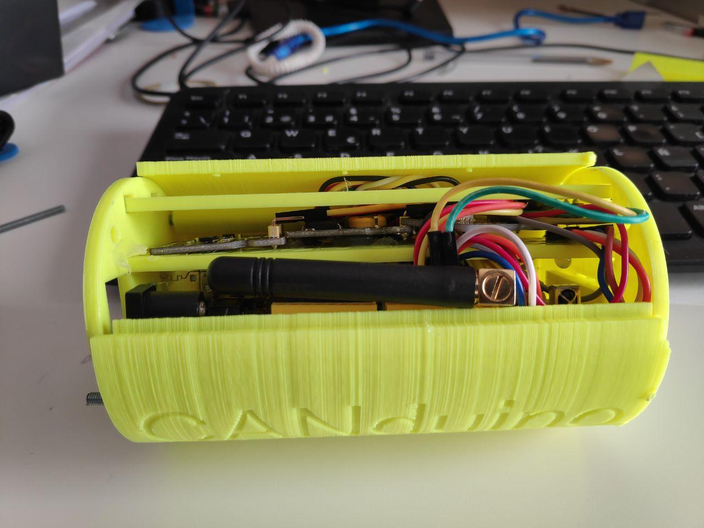
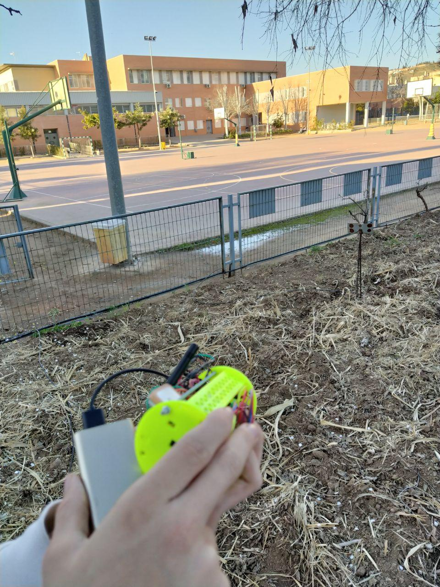
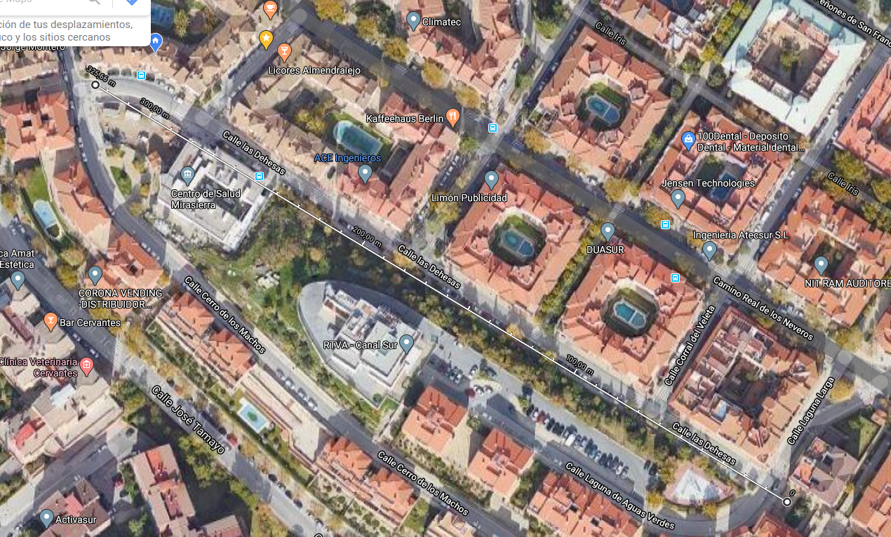

# Equipo SotoSat
El equipo SotoSat del IES Pedro Soto de Rojas de Granada con la colaboración de Lorenzo Olmo, Manuel Hidalgo @leobotmanuel, y Pepe Alcaide; ha hecho posible el proyecto **CanSat Educativo**.

**Diseño y construcción del paracaídas**

Probando el paracaídas

[1º Video paracaidas](../img/galeria/imagenesEquipo/paraca_03.mp4)

[2º Video paracaidas](../img/galeria/imagenesEquipo/paraca_01.mp4)

**Diseño e impresión 3D de la estructura**

**Electrónica con Arduino y Arduino Mega**

**Ensamblado de la electrónica en la estructura**

**Montaje completo y prueba con paracaídas**

[Video conjunto](../img/galeria/imagenesEquipo/paraca_06.mp4)

**Telemetría**

