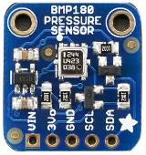
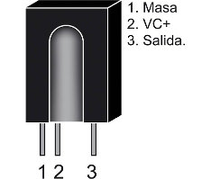

# Arduino Mega2560 Pro Mini.
El **CanSat Educativo** a tener como componente de control la placa **Arduino Mega Pro Mini** y el resto de componentes los conectamos a él.

## Pinout de los componentes

Arduino Mega2560 Pro Mini

Sensor BMP180

Receptor IR

GPS

Memoria microSD

Acelerómetro ADXL345

Radiofrecuencia APC220

## Esquema de conexiones

Esquema de conexiones

