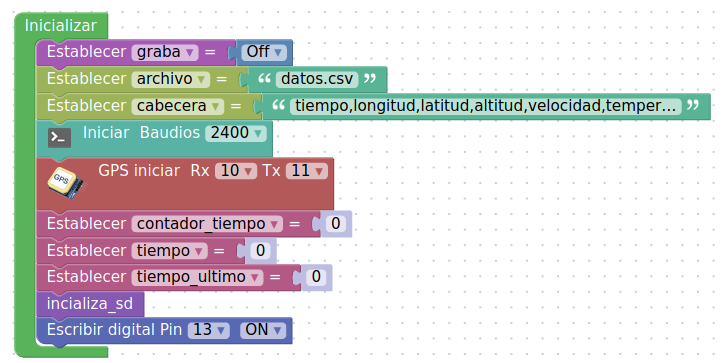
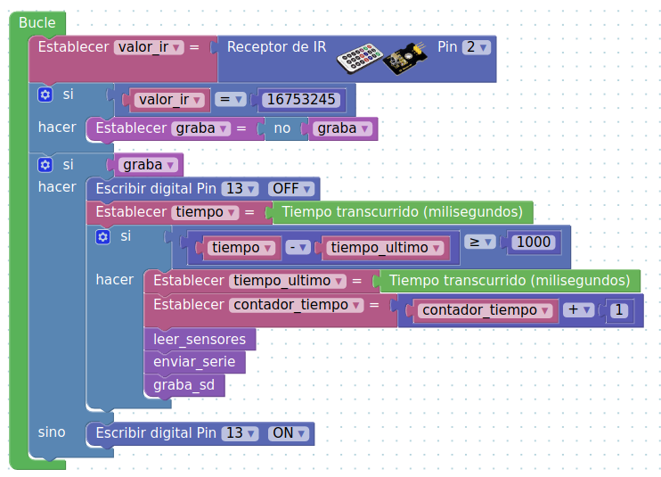
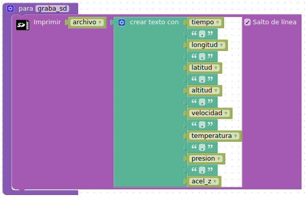
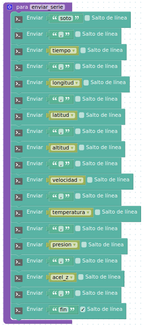

# Programa ArduinoBlocks

Proyecto compartido para arduino mega (V1): http://www.arduinoblocks.com/web/project/223835.

Dicho programa inicializa el la función setup (inicializar) parámetros como variables, la velocidad de transmisión, el gps, la inicialización de la SD y enciende el led asociado al pin 13.

Bloque del programa inicialización (Setup)

En el bucle principal leemos el valor del sensor de infrarrojo, si es un determinado valor cambia el valor de la variable booleana graba. Si graba es cierto apaga el led del pin 13 y deja el sistema preparado para cada segundo leer los sensores, grabarlos en la microsd y enviarlos por puerto serie por la radiofrecuencia.
Si graba es falso enciende el led del pin13.

Bloque del programa bucle (Loop)

El bloque de programa de la función **inicializa_sd** comprueba que existe la tarjeta y el archivo para grabar los datos, eliminando en el caso que exista uno con el nombre de **datos.csv**.

Bloque de la función **inicializa_sd**

El bloque de programa de la función **leer_sensores** asigna a la variable contado **tiempo** el número de la lectura realizada y a las demás variables los valores de los sensores.

Bloque de la función **leer_sensores**

El bloque de programa de la función **graba_sd** escribe en el archivo **datos.csv** los valores asgnados a las variables de los sensores.

Bloque de la función **graba_sd**

El bloque de programa de la función **enviar_serie** transmite por el módulo de radiofrecuencia APC220 una trama de datos que sean recibidos por la Estación Base.

Bloque de la función **enviar_serie**

