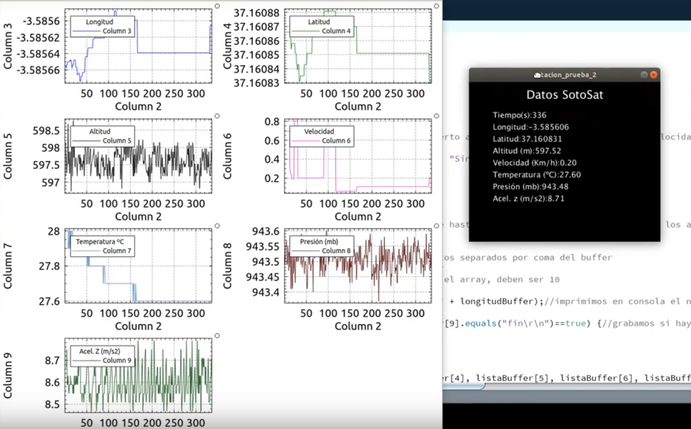

# Telemetetría avanzada, tratatamiento y graficado de datos
La misión secundaria que se aborda con este proyecto pretende ser de bajo coste y exportable al mayor número de situaciones, para ello se han escogido tres vías de actuación:

* Realizar telemetría avanzada usando sensores de bajo costo: posicionamiento gps, aceleración, velocidad, etc.
* Filtrado de datos en la estación base: se trata de un programa de processing en el PC de la estación base que recibe los datos en crudo de la emisión de cansat y los filtra detectando registros (tramas) incorrectas, para ello realiza tres comprobaciones que se deben cunplir a la vez, que el número de campos recibidos sea el correcto, que el campo de control de inicio se cumpla y que el campo de control final se cumpla. Con este filtrado conseguimos que los datos que no son correctos por fallos de transmisión (perdida de comunicación por falta de alcance en la emisión-recepción, interferencias) no lleguen al graficador en tiempo real que provocarían un mal graficado.
* Realizar el graficado con KST de los datos previamente filtrados presentando una gráfica por cada dato de telemetría recibida, siendo el eje X de todas las gráficas el tiempo de ejecución del lanzamiento.

Presentación y gráficas de los datos

## Enlaces de interés:
* Arduino y processing: https://youtu.be/gETASNUTwps
* Processing y puerto serie: https://polaridad.es/processing-serie-comunicaciones-uart/