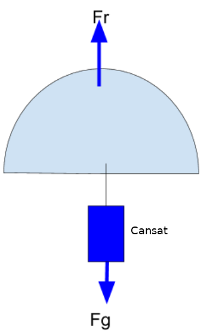

En el diseño del paracaídas hemiesférico vamos a tener en cuenta los requisitos que marca las bases del concurso Cansat:

* La masa del CanSat tiene que estar entre 300 y 500 g.
* El tiempo de vuelo máximo 120 s. (recomendado).
* La velocidad de descenso entre 6 y 12 m/s (la velocidad recomendada entre 8 y 11 m/s).

En el paracaídas se tiene el siguiente sistema de fuerzas:

Sistema de fuerzas

Relacionamos las fuerzas que se producen en el paracaídas con la superficie del paracaídas, que interviene como fuerza de resistencia Fr. 

Para los cálculos se igualamos la fuerza de resistencia del paracaídas (Fr) a el peso que mueve el paracaídas (Fg = m·g) hacia el suelo. Cuando estén igualadas deja de acelerar y la velocidad se convierte en constante, esa es la velocidad de caída.

Fg=m·g (peso CanSat)

Fr=1/2·r·Cd·A·V2 (fuerza de resistencia del paracaídas).

* r = densidad del aire (1,22 Kg/m 3).
* Cd = coeficiente de resistencia aerodinámico en paracaídas de forma hemiesférico su valor es 0,62.
* A = superficie del paracaídas (en nuestro caso semiesfera).
* V = velocidad de descenso.

1.- Igualando las dos expresiones

 m·g=½·r·Cd·A·V2 

de estas dos expresiones puedo despejar el área del paracaídas, 
A=2·(m·g)/r·Cd·V2

2.- Si la superficie del paracaídas es una semiesfera 

A=2·pi·R2

por tanto igualando:

2·pi·R2=2·(m·g)/r·Cd·V2

3.- Despejando R (radio) podemos calcular el diámetro de la superficie del paracaídas

Para determinar la velocidad de caída y si la velocidad es constante (sin aceleración), tenemos que V=e/t, el cohete alcanza 1000 m de altura (espacio a recorrer) y el tiempo dijimos 120 s, por tanto …., ya tenemos la V, además tenemos la masa de nuestro cansat (de 300g a 350g), con lo cual ya tenemos todo para calcular nuestro radio o diámetro de paracaídas.
