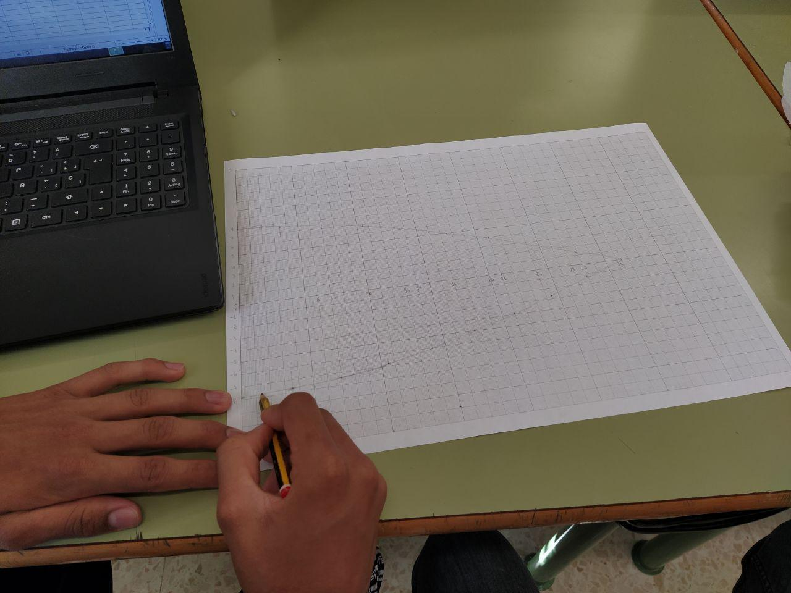

Los cálculos de la forma y dimensiones de las secciones (gores) del paracaídas, en función del radio y el número de secciones, hemos desarrollado una [hoja de cálculo](https://drive.google.com/file/d/1-Z3dpShxpypyg2hHrPxrzzwptYT9jEAG/view?usp=sharing).

Cálculo de las dimensiones de las secciones

La representación gráfica de los cálculos:

representación gráfica de la forma de las secciones

Dibujo de secciones del paracaídas para cortar

Corte de las secciones (gores) del paracaídas

[Video prueba paracaidas](../img/galeria/imagenesEquipo/paraca_01.mp4)

